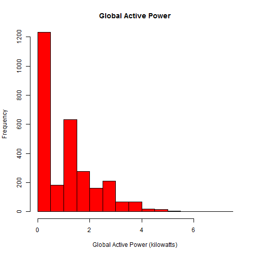
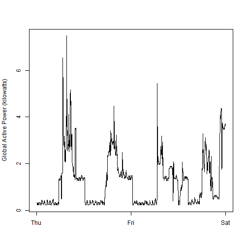
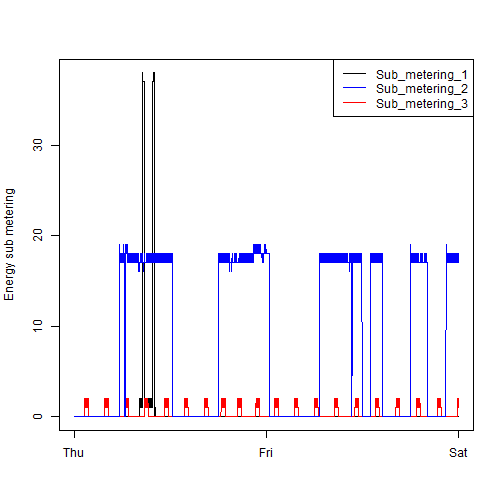
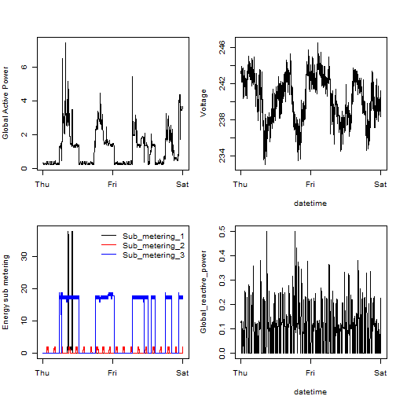

## Coursera Exploratory Data Analysis Course Project 1
Repository containing the course project for the Exploratory Data Analysis Course] (https://www.coursera.org/course/exdata-014) offered by Johns Hopkins University on Coursera.

## Summary
The project demonstrates the ability to work with the base graphics package with the goal of reproducing a number of reference plots.

## Data
The data used for this project was originally obtained from the [UCI Machine Learning Repository](http://archive.ics.uci.edu/ml/index.html) and is represents ([Individual household electric power consumption](https://archive.ics.uci.edu/ml/datasets/Individual+household+electric+power+consumption)).  A copy of this dataset ([Electric power consumption [20Mb]](https://d396qusza40orc.cloudfront.net/exdata%2Fdata%2Fhousehold_power_consumption.zip)) was obtained from the Course website.

## Processing
The data is processed by an R script function called prepare_data which does the following:

1. Extracts the data from a zipped file
2. Converts the date column to a Date representation
3. Filters the data so we only have 2007-02-01 and 2007-02-02 present
4. Converts the datetime column to a POSIXct (number of seconds since epoch) representation
5. Returns the prepared data in a frame

## Files
1. `README.md` - this file.
1. `plot1.R`, `plot2.R`, `plot3.R` and `plot4.R` all contain the R script that processes the raw data and produces the data for plotting
2. `plot1.R`, `plot2.R`, `plot3.R` and `plot4.R` also contain specific functionality to reproduce the reference plots 

## Analysis
The reproduction graphs are produced by a collection of R scripts (`plot1.R`, `plot2.R`, `plot3.R` and `plot4.R`). Each script contains a function called `plotn (n=1..4)`.  The source for the script must be loaded into the workspace, and the analysis can be initiated by executing the `process.data()` function.  This executes the steps:

1. Check and install the [downloader](http://cran.r-project.org/web/packages/downloader/index.html) package if required
2. Check for the raw data file `household_power_consumption.zip` in the `data` subdirectory.  If the file is not present it will be downloaded from (https://d396qusza40orc.cloudfront.net/exdata%2Fdata%2Fhousehold_power_consumption.zip)
3. Load and process the data into memory from the raw data file 'household_power_consumption.zip'
4. Reference plots are reproduced using the features of the Base Plotting System
5. The raw data file `household_power_consumption.zip` is retained to avoid further downloads for addiitonal processing runs

Upon return from the `plot1()`, `plot2()`, `plot3()` and `plot4()` functions the reproductions of the reference plots will be in the working directory.

The four plots that you will constructed versus the reference plots are shown below. 

### Plot 1

#### Reference

 

#### Reproduction

 

### Plot 2

#### Reference

 

#### Reproduction

 

### Plot 3

#### Reference

 

#### Reproduction

 

### Plot 4

#### Reference

 

#### Reproduction

 
